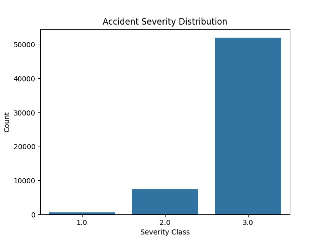
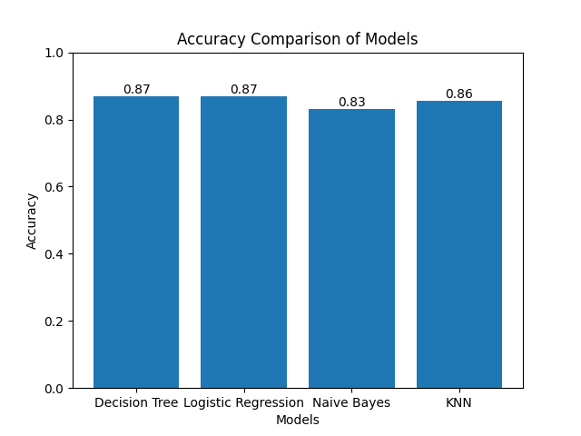
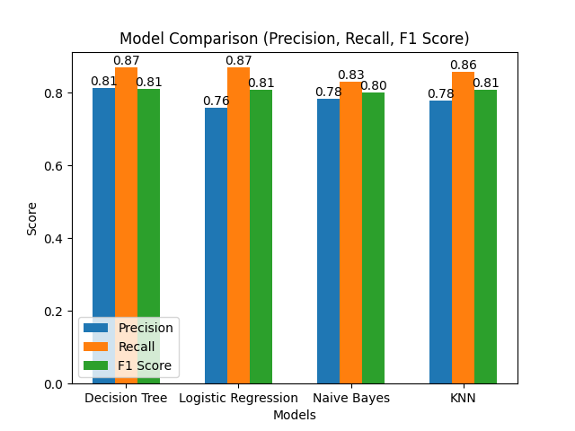
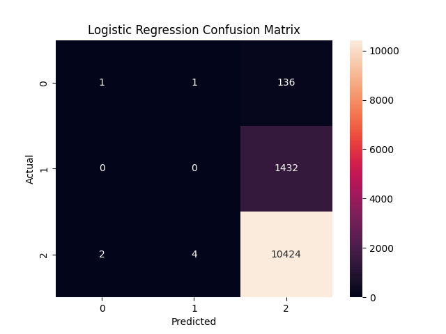

# Traffic Accident Severity Prediction

## 📌 Project Objective

The goal of this project is to predict the **severity of road accidents** using Machine Learning techniques based on real-world accident data.

This helps in:

* Identifying high-risk conditions
* Improving road safety awareness
* Supporting decision-making for traffic management

---

## 📊 Dataset

* Source: Government/Kaggle Accident Dataset
* Records: ~1,000,000 (cleaned to ~60,000)
* Features include:

  * Speed Limit
  * Weather Conditions
  * Road Surface Conditions
  * Light Conditions
  * Number of Vehicles
  * Number of Casualties
  * Urban/Rural Area

dataset link:https://www.kaggle.com/datasets/data125661/india-road-accident-dataset

---

## ⚙️ Machine Learning Models Used

We implemented and compared multiple models:

1. 🌳 Decision Tree
2. 📈 Logistic Regression
3. 📍 K-Nearest Neighbors (KNN)
4. 📊 Naive Bayes

---

## 🔄 Project Pipeline

1. Data Loading
2. Data Cleaning (handling missing values)
3. Feature Selection
4. Train-Test Split
5. Model Training
6. Model Evaluation
7. Prediction using User Input

---

## 📈 Evaluation Metrics

We evaluated models using:

* Accuracy
* Precision
* Recall
* F1 Score

---

## 📊 Results

* Best Accuracy: ~86.9% (Decision Tree)
* Logistic Regression: ~86.8%
* KNN and Naive Bayes showed lower performance due to data imbalance
* Decision Tree performed best overall

---

## 📉 Visualizations

### Severity Distribution


### Model Comparison


### Model Comparison


### Decision Tree Confusion Matrix


### Logistic Regression Confusion Matrix

---

## 🔍 Feature Importance (Decision Tree)

Most important factors influencing accident severity:

* Number of Vehicles
* Number of Casualties
* Speed Limit

---

## 🧠 Key Observations

* Dataset is highly **imbalanced**
* Model predicts majority class (Severity 3) more often
* Accuracy is high but **precision/recall for minority classes is low**

---

## 🧪 Sample Prediction

User can input conditions like:

* Speed
* Weather
* Road condition
* Vehicles involved

👉 Model predicts accident severity in real-time

---

## 🚀 Future Improvements

* Apply SMOTE to handle imbalance
* Use advanced models (Random Forest, XGBoost)
* Hyperparameter tuning
* Deploy as a web application

---

## 💻 Tech Stack

* Python
* Pandas
* NumPy
* Scikit-learn
* Matplotlib
* Seaborn

---

## 📁 Project Structure

```
traffic-accident-project/
│
├── data/                # Dataset (not uploaded)
├── main.py              # Main code
├── requirements.txt     # Dependencies
└── README.md            # Project documentation
```

---

## 👩‍💻 Author

**Payal Choudhary**

---


## ⭐ Conclusion

This project demonstrates how Machine Learning can be used to analyze real-world accident data and predict severity, helping in improving road safety strategies.

---
